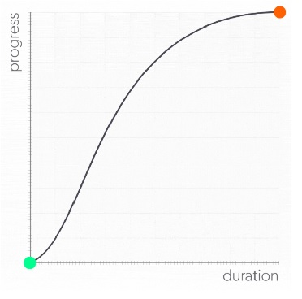
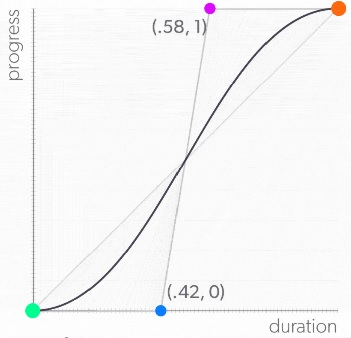

To **create animations with CSS**, you use either **transitions** or **keyframes**. While **keyframes require a bit more** to get set up and running, transitions only require a few bits of info to create. They are perfect for quick, simple animations, such as changing the appearance of a button when the user hovers over it.

## Transitions
Transitions allow **change the value of a property over a set amount of time**. The **startpoint is the initial value** of the animated property, the **endpoint is its final value**, and the **time to complete is its duration**, and **trigger**. 
```html
<style>
.btn {
    transform: scale(1); /*startpoint*/
    transition-property: transform; /*for duration*/
    transition-duration: 400ms; /*for duration*/
}
.btn:hover { transform: scale(1.15); } /*endpoint, destination, hover is trigger*/
</style>
<div class="btn">Look Ma! I'm growing!</div>
```
Shorthand:
```css
.btn {
    transform: scale(1); /*startpoint*/
    transition: transform 400ms; /*for duration*/
}
.btn:hover { transform: scale(1.15); } /*endpoint, destination, hover is trigger*/
```

## Pseudo-classes
[50 pseudo-classes](https://developer.mozilla.org/en-US/docs/Web/CSS/Pseudo-classes)

A pseudo-class is a lot like an if-statement for the browser: **If the condition of the pseudo-class is true, then apply its styling to the object**.

Following are pseudo-classes **commonly used** in conjunction with transitions:
- `:hover`
- `:active`
- `:focus`
- `:valid`
- `:invalid`
- `:not()`
- `:checked`
- `:enabled`
- `:disabled`

[HTML5 validate fields](https://developer.mozilla.org/en-US/docs/Learn/HTML/Forms/Form_validation)
```html
<style>
.form__group input {
    border: 2px solid yellow;
    outline: none;
}
.form__group input:focus { border: 2px solid green; }
.form__group input:invalid { background: red; border: 2px solid red; } 
</style>
<div class="form">
    <div class="form__group">
        <label for="">email</label>
        <input type="email" name="" id="">
    </div>
</div>
```
It's validating the email address as it's being entered, but flickering between the `:focus` and `:invalid` is a bit obnoxious. Let's make use of the `:not()` pseudo-selector, combined with the `:focus` pseudo-selector to allow the user to finish entering their email address before telling them whether it's valid or not. The `:not()` pseudo-selector registers as `true` when it's containing selector registers as `false`.
```css
.form__group input:focus { border: 2px solid green; }
.form__group input:not(:focus):invalid { background: red; border: 2px solid red; }
```
In this case, `:not()` will return `true` if the `input` is **not** in the `:focus` state. You can **chain pseudo-classes together**, just like with standard classes. In this case, we've created a pseudo-selector that will apply its rule set if the element isn't in the `:focus` state **and** the email address is `:invalid`. 

Let's add animation to the changes in state by adding a transition for the  `background-color`.
```css
.form__group input {
    border: 2px solid yellow;
    outline: none;
    transition: background-color 500ms; /* ! */
}
```


### Trigger transition on another element
For a pseudo-selector to **trigger a transition on another element**, that element **must be the next sibling** in the HTML document. In other words, you must use the adjacent sibling combinator:  `+`  when setting up the transition.

```html
<style>
.btn:hover + .ball{
    transform: scale(1.5);
}
.ball { width: 20px; height: 20px; }
</style>

<div class="container">
    <div class="btn">Grow!</div>
    <div class="ball"></div>
</div>
```
Now when you hover over the button, `.ball` will scale up **instead** `.btn`.

Let's change things up a bit, and, rather than starting huge and getting huger, let's have it start small by setting the initial `scale()` to `.1`, and add a transition.
```css
.btn:hover + .ball{
    transform: scale(1.5);
}
.ball {
    transform: scale(0.1);
    transition: transform 4000ms;
}
```
Finally, let's change the `:hover` selector to `:active`, so **the scale increases when the button is pressed**, rather than simply hovered over.
```css
.btn:active + .ball{
    transform: scale(1.5);
}
.ball {
    transform: scale(0.1);
    transition: transform 4000ms;
}
```

### The 12 principles of animation:
[Wikipedia](https://en.wikipedia.org/wiki/Twelve_basic_principles_of_animation)
- Squash and stretch
- Anticipation
- Staging
- Straight ahead and pose-to-pose
- Follow through and overlapping action
- Slow in and slow out
- Arc
- Secondary action
- Timing
- Exaggeration
- Solid drawing
- Appeal

### Combine transitions:
Previously, we built a button that grows when hovered over. It's built as a `<div>` with the class of  `.btn` assigned to it:
```scss
.btn {
    background-color: red;
    transition: transform 450ms;
    &:hover {
        transform: scale(1.2);
    }
}
```
Let’s spice up the button a bit and layer in some **secondary animation** by creating a `:hover` state that fades in the `background` as the button expands. There's a few ways to go about animating opacity, and we'll talk about a more performant (but complex) solution in a bit. But for the sake of simplicity, let's transition the `background-color`  between two different `rgba()` values. 
```scss
$cd-btn-start: rgba(1, 28, 55, 0);
$cd-btn-end: rgba(1, 28, 55, 1);
```
They both have the same RGB values, but `$cd-btn-start` has an alpha value of `0`, making it **transparent**, whereas `$cd-btn-end` has an alpha value of `1`, making it **opaque**. Now, to add a transition for our opacity change, we need to add new color variables to the `.btn`  selector and its `:hover` state:
```scss
.btn {
    background-color: $cd-btn-start;
    &:hover {
        transform: scale(1.2);
        background-color: $cd-btn-end;
    }
}
```
When you want to **transition multiple properties at once**, rather than typing the name of the property that you want to transition: `transition: transform 450ms;`. Instead use the `all` keyword in its place:
```css
transition: all 450ms;
```
By using the `all` keyword, you are telling the browser to **transition all of the properties you have changed**.
```scss
.btn {
    background-color: $cd-btn-start;
    transition: all 450ms;
    &:hover {
        transform: scale(1.2);
        background-color: $cd-btn-end;
    }
}
```


Using the `all` keyword is perfect for when you want **multiple things to happen at the same time, and for the same duration**, but there's **another way** to add multiple properties to a transition.  Rather than using all, you can **list out the animations for each property** that you'd like to transition, separated by commas.
```css
transition: transform 450ms, background-color 300ms; /* transitions for transform and background-color */
```
Now that they're separate, you can **give them different durations**. Now the `background-color` will be fully opaque before the button has finished scaling up.

### Delaying transitions:
Right now we are transitioning two properties, with two separate durations, but **both begin simultaneously**. What would be nice is if the `background-color` transition **waited 150ms before starting** so that they both finish their animations at the same time. 

We need to use the `transition-delay` property:
```css
transition-delay: 150ms;
```
Since there are two transitions occurring, you need to **specify a value for each, in the order that they are declared** in the `transition` property: 
```css
transition: transform 450ms, background-color 300ms;
transition-delay: 0, 150ms;
```
But, just like  `transition-property` and `transition-duration`, you can write the same thing more concisely by adding `transition-delay` values to the `transition` property itself, after the  `transition-duration` values:
```css
transition: transform 450ms, background-color 300ms 150ms;
```
In the case of an absence for a delay value, the `transition` property will assume a zero delay, so you can omit it in `transform`.
```scss
.btn {
    background-color: $cd-btn-start;
    transition: transform 450ms, background-color 300ms 150ms;
    &:hover {
        transform: scale(1.2);
        background-color: $cd-btn-end;
    }
}
```
### Timing functions:
Every object that has ever moved and ever will move does two specific things. To begin moving, they have to **accelerate**, and before they can stop, they have to **decelerate**. If you want your animations to **feel grounded and authentic**, then it’s vital that you pay attention to how objects accelerate and decelerate, or, in animation terminology, how they **ease in** and **ease out**.

The X-axis represents the percentage of the duration completed, and the Y-axis represents the percentage of the motion completed. Start at 0% duration and 0% progress in the lower left corner, and finish in the upper right corner, where both the progress and durations have reached 100%. 



Notice that the **velocity isn't a straight line**. Instead, its slope changes as the box accelerates at the beginning and decelerates at the end. In the beginning, the box isn't moving very quickly yet, so it hasn't completed as much progress as it has duration, making the line flatter.

 In CSS, these **acceleration curves** are called **timing functions**, and you can use the  `transition-timing-function`  property to set the acceleration curves for your transitions.
 
 **CSS comes preloaded with a variety of its own curves** right at your fingertips. Let's begin with the curve that wasn't. 
 - `linear` timing function has no acceleration or deceleration to its velocity.
 ```css
transition: transform 1000ms;
transition-timing-function: linear;
```
... or Shorthand:
```css
transition: transform 1000ms linear;
```
- `ease-in-out` speed ramping up and down, but it's subtle enough to sort of disappear into the motion. In other words, it looks and feels natural. 
```css
transition: transform 1000ms ease-in-out;
```
You also have the option to just **ease in**, or **ease out** of motion with the `ease-in` and `ease-out` keywords.
```css
/* ease-in timing-function: */
transition: transform 1000ms ease-in;

/* ease-out timing-function: */
transition: transform 1000ms ease-out;
```
`ease-in` graph is essentially **the start of the `ease-in-out` graph, with a `linear` ending**. And `ease-out` is just the opposite, with a `linear` start and `ease-in-out`'s deceleration curve.

 **If you don't manually choose one, the browser will apply the `ease` timing function**, which sounds a lot like the other curves we've just covered. However, it has its own distinct profile, featuring a sharper acceleration profile, while the deceleration ramp is more pronounced.
 
 #### Own functions
 CSS' built-in timing functions are really just shorthand for `cubic-bezier` functions. 
 ```css
.selector {
    transition-timing-function: cubic-bezier(.42, 0, .58, 1);
}
```
`cubic-bezier()` **requires a list of four numbers** as arguments, which are actually the **coordinates for two points** that live on the plane of the graph. The first two numbers are the X and Y coordinates for the point that determines the ease in of the acceleration curves, and the second pair determines its ease out
```css
.selector {
                                            /*(X1,Y1)(X2,Y2)*/
    transition-timing-function: cubic-bezier(.42, 0, .58, 1);
}
```



**Online tool to help build** it, such as [cubic-bezier.com](https://cubic-bezier.com/#.17,.67,.83,.67).

## Rendering in browser
**Frames per second, or fps**, refers to the number of individual frames rendered in a given second. The higher the fps, the smoother the motion will feel.

With **traditional animation, the frame rate is fixed**, and all of the frames are created before the animation is played back. But CSS animations are rendered on the fly by the browser, which will update the animation with the new frames as quickly as it can calculate them. That means that the **frame rates of our animations are variable**. Let’s say that it takes the browser `.04` seconds to complete a calculation of one frame of an animation, and then `.03` seconds to complete the next. That means that the animation had a frame rate of `25fps` for the first frame, and then `30fps` for the second.

The question isn’t so much what the frame rate of our animation is, but, instead, **what we want the frame rate to be**.  And that magical number is **60fps**. And why 60fps? **Most screens refresh at a rate of 60hz**, or 60 times per second. If we create an animation that plays back at 75fps, the viewer would still only see 60 of those frames per second due to the monitor not refreshing fast enough to see those extra frames. That means that we want to keep the calculation time of our animation frames beneath 1/60th of a second, or .016 seconds (16 milliseconds). And just how do you go about keeping animation calculations at no more than 16 milliseconds? The secret can be found in the process of going **from CSS code to a rendered web page** in your browser.

The browser goes through four steps:
1. **Style**: The browser goes through the CSS and figures out which rules to apply to which elements.
2. **Layout**: Now that the browser knows how to style everything, it figures out how big to make the elements and where to put them.  
3. **Paint**: The browser renders the elements to pixels using the calculated styles from step 1, and the positions and sizes derived from the layout calculations from step 2.
4. **Composite**: The browser layers all of the elements together into the rendered page you see in the browser.

**Different CSS properties are applied at different stages** of the rendering process. Properties such as  `width` and `height` are applied during the **layout stage**, while ones like `color` and  `box-shadow` are part of the **paint stage**.

For a comprehensive look at which properties trigger layout vs. paint vs. composite, check out [csstriggers.com](csstriggers.com)!

That means that **if you animate a `color` value, the browser needs to repaint and composite the element for each calculation**. An animation that affects an element of the layout, such as width, means the browser needs to recalculate the layout of the entire page and then repaint for each calculation! The **more the browser needs to calculate, the longer it will take to process, which means a lower frame rate**! When the frame rate dips low enough to see individual frames and the motion becomes halting, we call that **jank**, and it’s an animator's worst enemy. The key **to avoiding it is to restrict yourself to animating properties that don’t trigger layout or paint calculations**. In other words, **you only want to animate properties that are part of the composite stage** of the render. And, in terms of properties that are well suited to animation, there are two to chose from: The `transform` and `opacity` properties.

You can see that as the ball changes size, it doesn’t affect the position of the button. That’s because the `transform` property performs its operations in the composite stage, so it doesn’t create any layout or paint changes, which means less to calculate and more frames per second.

### `Transform` functions
#### Scale
For example, to scale an object to 200% of its original size, use the `scale()` function with an argument of  `2`:
```css
.box { transition: transform 330ms ease-in-out; }
.btn:hover + .box { transform: scale(2); }
```
You **can also pass two arguments**, one to scale the width, or X dimension, and one to scale the height, or Y dimension, individually. Let’s say that we wanted to stretch the box, width-wise, and make it shorter at the same time to preserve its volume. 
```css
.box { transition: transform 330ms ease-in-out; }
.btn:hover + .box { transform: scale(3, 0.5); }
```
When you only want to scale in one direction, make use of the  `scaleX()` and `scaleY()` functions. As you might have guessed, `scaleX()` scales an object horizontally, and `scaleY()` scales vertically.
#### Position
Changing an object’s position can be done using transform ’s  `translate()` function.  `translate()`  accepts two arguments, the first being how far you want to move it in the X-axis, and the second is the distance to translate on the Y-axis. The values can be real units, such as  `px`  or  `vh`, so you can move the box `150px` to the right and up `7vh`  like so:
```css
.box { transition: transform 330ms ease-in-out; }
.btn:hover + .box { transform: translate(150px, -7vh); }
```
But translates are also assigned by **percentage**. Where other properties use percentages in relation to their parent element, such as  `width: 50%`  being half of the width of its parent. When you use percentages with `translate()`, they are in **relation to the element itself**. Let’s say that you have an element that is `100px` wide:
```css
.box {
    width: 100px;
    height: 100px;
    transition: transform 330ms ease-in-out;
}
.btn:hover + .box { transform: translate(100px, 0); }
```
If you translate it by `100%` on the x-axis, it will move 100px to the right. Just like `scale()`, you can transform elements in the x-axis and y-axis individually, using the  `translateX()` and `translateY()` functions.

To animate the text separate from its parent element, you need to wrap it in some sort of element. So lets put it in a `<span>`:
```html
<div class="container">
    <button class="btn">Transform!</button>
    <div class="box">
        <span>Boop!</span>
    </div>  
</div>
```
```scss
.btn {
    &:hover + .box {
        transform: scale(1);
        span {
            transform: translateY(0);
        }
    }
}
.box {
    transform: scale(0.1);
    transition: transform 330ms ease-in-out;
    overflow: hidden;
    span {
        display: inline-block;
        transform: translateY(250%);
        transition: transform 280ms ease-out 50ms; 
    }
}
```
Notice that we’ve changed the display mode to `inline-block`? **Transform can’t manipulate inline elements**, like  `<span>` , so you need to change their display mode to `block` or `inline-block`  before you will see any results.  We've also added the `overflow` property to the span's parent,  `.box`, and set it to  `hidden` so you don't see the text before it has scrolled into view. 


#### Rotation
`transform` performs with the aptly titled `rotate()` function. You can supply values to `rotate()` in a few different units, but only two of them are user-friendly/comprehensible by humans. And since we're humans, let's stick with those two.

The most obvious and straightforward is to use **degrees**, annotated with `deg`:  `rotate(360deg)`. You can also use **turns**, where one turn is equal to 360 degrees:`rotate(1turn)`. To demonstrate, we have two boxes, each with their own modifiers for the rotation units used.
```scss
.btn {
    &:hover + .boxes {
        & > .boxes--rotDegrees { transform: rotate(0deg); }
        & > .boxes--rotTurns { transform: rotate(0turn); }
    }
}
.boxes {
    &--rotDegrees {
        transform: rotate(-360deg);
        transition: transform 500ms ease-in-out;
    }
    &--rotTurns {
        background: pink;
        transform: rotate(-1turn);
        transition: transform 500ms ease-in-out;
    }
}
```
#### Combination all
**Only one transform property can be assigned to an element**. 

How do you perform multiple transformations within a single transform property then?

Simple. Just list out all of the transform functions that you want to use within the transform property.
```scss
.btn {
    &:hover + .box {
        transform: scale(1) rotate(0deg); /* ! */
        span {
            transform: translateY(0);
        }
    }
}
.box {
    overflow: hidden;
    transform: scale(.1) rotate(-90deg);
    transition: transform 330ms ease-in-out;
    span {
        transform: translateY(250%);
        transition: transform 280ms ease-out 50ms;
        display: block;
    }
}
```
There is a catch to using multiple functions: the order in which you assign the functions can greatly change the end results. **The browser performs the calculations for each function in order, from right to left.**

## Change anchor point
`transform-origin` lets you move the epicenter of your transformation away from the default center of the element based on the values that you assign it.
```html
<div class="container">
    <div class="btn">Load Something!!!</div>
    <div class="progress">
        <div class="progress__bar"></div>
    </div>
</div>
```
```scss
.progress {
    &__bar {
        transform-origin: 0% 50%;
        transform: scaleX(0);
        transition: transform 1000ms;
    }
}
.btn {
    &:active {
        & + .progress {
            & > .progress__bar {
                transform: scaleX(1);
            }
        }
    }
}
```